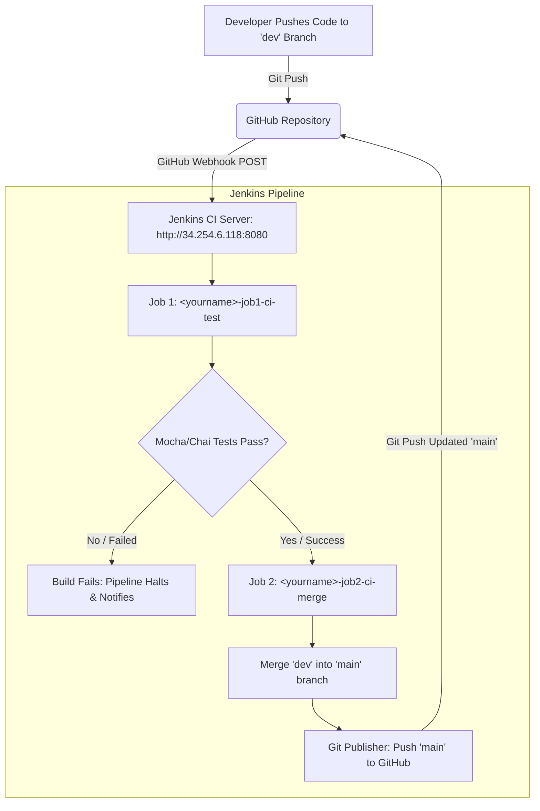

# Sparta Test App: CI/CD Pipeline Documentation

---

## Table of Contents
1. [Overview & Pipeline Architecture](#overview--pipeline-architecture)
2. [Why We Setup the CI Pipeline This Way](#why-we-setup-the-ci-pipeline-this-way)
   - [Benefits Observed](#benefits-observed)
   - [Organizational Benefits](#organizational-benefits)
3. [Authentication & Security Setup](#authentication--security-setup)
4. [GitHub Webhook Configuration](#github-webhook-configuration)
5. [Jenkins Job Configuration](#jenkins-job-configuration)
   - [Job 1: `<yourname>-job1-ci-test` (Testing Job)](#job-1-yourname-job1-ci-test-testing-job)
   - [Job 2: `<yourname>-job2-ci-merge` (Automated Merge Job)](#job-2-yourname-job2-ci-merge-automated-merge-job)
6. [Pipeline Execution & Flow](#pipeline-execution--flow)
7. [Evidence of Success](#evidence-of-success)
   - [Job 1 Console Output](#job-1-console-output-ci-test)
   - [Job 2 Console Output](#job-2-console-output-ci-merge)
   - [GitHub Verification](#github-merge-verification)

---

## Overview & Pipeline Architecture

This CI/CD pipeline automates testing and code integration for the Sparta Node.js application. Whenever a developer pushes changes to the `dev` branch, a GitHub Webhook triggers **Job 1 (Test)** on the Jenkins server (`http://34.254.6.118:8080`). If all automated unit and integration tests pass, Jenkins automatically triggers **Job 2 (Merge)**, which merges the tested `dev` code into the production-ready `main` branch and pushes the updated `main` branch back to GitHub.

### Pipeline Architecture Diagram



---

## Why We Setup the CI Pipeline This Way

### Rationale
* **Branch Isolation & Protection:** Direct commits to `main` are restricted. All feature development and experimentation occur on `dev`.
* **Quality Gatekeeping:** Code is never merged into the release branch (`main`) unless it has passed 100% of automated tests.
* **Separation of Concerns:** By splitting the workflow into two modular jobs (`job1-ci-test` and `job2-ci-merge`), responsibilities are isolated. If testing logic evolves or fails, the merge logic remains unaffected.

### Benefits Observed
1. **Immediate Feedback:** Developers receive test execution results within seconds of running `git push`.
2. **Zero Manual Merge Overhead:** Eliminates manual pull requests and merge conflicts for routine, verified changes.
3. **Reproducible Test Environment:** Tests run in a standardized Node.js runtime on the Jenkins agent, eliminating "it works on my machine" issues.

### Organizational Benefits
* **Accelerated Time to Delivery:** Automating the integration cycle reduces deployment lead times.
* **Lower Defect Density:** Catches breaking changes and regressions before they reach production.
* **Auditability & Traceability:** Every commit, test run, and merge is logged with timestamped console outputs and linked commit SHAs.

---

## Authentication & Security Setup

To enable Jenkins to clone private repositories and push merged branches back to GitHub:

1. **SSH Key Pair / Personal Access Token (PAT):**
   * An SSH Key pair or GitHub PAT with `repo` scopes (read & write) is generated.
   * Public key is added to GitHub (**Settings > SSH and GPG Keys** or **Repository > Settings > Deploy Keys** with write access enabled).
2. **Jenkins Credentials Store:**
   * In Jenkins (**Manage Jenkins > Credentials > System > Global credentials**), add a new credential:
     * **Kind:** `SSH Username with private key` (or `Username with password` using GitHub PAT).
     * **ID:** `github-ssh-key` (or your user credential ID).
     * **Private Key:** Insert the matching private key.

---

## GitHub Webhook Configuration

The webhook notifies Jenkins of push events in real-time.

1. Navigate to your GitHub repository: `https://github.com/<your-username>/techXXX-sparta-app-cicd-jenkins`.
2. Go to **Settings > Webhooks > Add webhook**.
3. Fill in the fields:
   * **Payload URL:** `http://34.254.6.118:8080/github-webhook/`
   * **Content type:** `application/json`
   * **Secret:** *(Leave blank unless configured in Jenkins global settings)*
   * **Which events would you like to trigger this webhook?** Select **"Just the push event"**.
   * **Active:** Ensure checkbox is ticked.
4. Click **Add webhook**.

---

## Jenkins Job Configuration

Navigate to **Jenkins Dashboard** (`http://34.254.6.118:8080/view/all/newJob`) to create the two jobs.

### Job 1: `<yourname>-job1-ci-test` (Testing Job)

1. **Item Name:** `<yourname>-job1-ci-test` (e.g., `oscar-job1-ci-test`)
2. **Type:** Select **Freestyle project** and click **OK**.
3. **General:**
   * Tick **GitHub project** and enter: `https://github.com/<your-username>/techXXX-sparta-app-cicd-jenkins/`
   * Tick **Discard old builds** (Log rotation: Max # of builds to keep = `5`).
4. **Source Code Management:**
   * Select **Git**.
   * **Repository URL:** `git@github.com:<your-username>/techXXX-sparta-app-cicd-jenkins.git` (or HTTPS URL with token).
   * **Credentials:** Select your configured GitHub credentials.
   * **Branches to build:** `*/dev`
5. **Build Triggers:**
   * Tick **GitHub hook trigger for GITScm polling**.
6. **Build Environment:**
   * Tick **Provide Node & npm bin/ folder to PATH** (select Node.js 18.x/20.x if dropdown is available).
7. **Build Steps:**
   * Add build step: **Execute shell**.
   * Command:
     ```bash
     cd app
     npm install
     npm test
     ```
8. **Post-build Actions:**
   * Add post-build action: **Build other projects**.
   * **Projects to build:** `<yourname>-job2-ci-merge`
   * **Trigger condition:** `Trigger only if build is stable`.
9. Click **Save**.

---

### Job 2: `<yourname>-job2-ci-merge` (Automated Merge Job)

1. **Item Name:** `<yourname>-job2-ci-merge` (e.g., `oscar-job2-ci-merge`)
2. **Type:** Select **Freestyle project** and click **OK**.
3. **General:**
   * Tick **GitHub project** and enter: `https://github.com/<your-username>/techXXX-sparta-app-cicd-jenkins/`
   * Tick **Discard old builds** (Max # of builds to keep = `5`).
4. **Source Code Management:**
   * Select **Git**.
   * **Repository URL:** `git@github.com:<your-username>/techXXX-sparta-app-cicd-jenkins.git`
   * **Credentials:** Select your configured GitHub credentials (must have push/write access).
   * **Branches to build:** `*/dev`
   * Click **Add** under **Additional Behaviours**:
     * Select **Merge before build**.
     * **Name of repository:** `origin`
     * **Branch to merge to:** `main`
     * **Merge strategy:** `default`
     * **Fast-forward mode:** `FF mode` (or `default`)
5. **Build Triggers:**
   * Tick **Build after other projects are built**.
   * **Projects to build:** `<yourname>-job1-ci-test`
   * Tick **Trigger only if build is stable**.
6. **Post-build Actions:**
   * Add post-build action: **Git Publisher**.
   * Tick **Push Only If Build Succeeds**.
   * Tick **Merge Results**.
   * Click **Add Branch**:
     * **Branch to push:** `main`
     * **Target remote name:** `origin`
7. Click **Save**.

---

## Pipeline Execution & Flow

To trigger and test the full automated cycle:

1. **Switch to dev branch locally:**
   ```bash
   git checkout dev
   ```
2. **Make a visual or functional change in the app:**
   * Example: Edit [`app/views/index.ejs`](file:///c:/Users/oanzi/Sparta/pre-tech613-sparta-app-cicd-jenkins/app/views/index.ejs)
3. **Commit and push to remote dev branch:**
   ```bash
   git add app/views/index.ejs
   git commit -m "feat: updated welcome message and verified CI test suite"
   git push origin dev
   ```
4. **Automated Pipeline Flow:**
   * GitHub Webhook sends a payload to Jenkins.
   * Jenkins triggers **Job 1 (`<yourname>-job1-ci-test`)**.
   * Job 1 installs dependencies and runs Mocha/Chai tests (`npm test`).
   * When Job 1 succeeds, it automatically triggers **Job 2 (`<yourname>-job2-ci-merge`)**.
   * Job 2 checks out `dev`, merges into `main`, and pushes the updated `main` branch to GitHub.

---

## Evidence of Success

### Job 1 Console Output (CI Test)
```text
Started by GitHub push by <your-username>
Running as SYSTEM
Building in workspace /var/jenkins_home/workspace/<yourname>-job1-ci-test
 > git rev-parse --resolve-git-dir /var/jenkins_home/workspace/<yourname>-job1-ci-test/.git # timeout=10
 > git checkout -f -B dev origin/dev
[<yourname>-job1-ci-test] $ /bin/sh -xe /tmp/jenkins89234892.sh
+ cd app
+ npm install
added 120 packages in 3s
+ npm test

> sparta-test-app@1.0.1 test
> npx mocha --exit

  Homepage
    ✓ should display the homepage at / GET (45ms)
    ✓ should contain the word Sparta at / GET (12ms)

  Fibonacci
    ✓ should display the correct fibonacci value at /fibonacci/10 GET (18ms)

  3 passing (110ms)

Triggering a new build of <yourname>-job2-ci-merge
Finished: SUCCESS
```

### Job 2 Console Output (CI Merge)
```text
Started by upstream project "<yourname>-job1-ci-test" build number 1
originally caused by:
 Started by GitHub push by <your-username>
Running as SYSTEM
Building in workspace /var/jenkins_home/workspace/<yourname>-job2-ci-merge
 > git checkout -f -B dev origin/dev
 > git merge --ff origin/main
Merging dev into main...
Commit merged cleanly.
 > git push origin HEAD:main
To github.com:<your-username>/techXXX-sparta-app-cicd-jenkins.git
   a1f03e9..b2d91f4  HEAD -> main
Finished: SUCCESS
```

### GitHub Merge Verification
* **Branches View:** `main` and `dev` share the latest commit SHA.
* **Commit History on `main`:** Displays the newly tested commit merged cleanly without manual pull request intervention.
