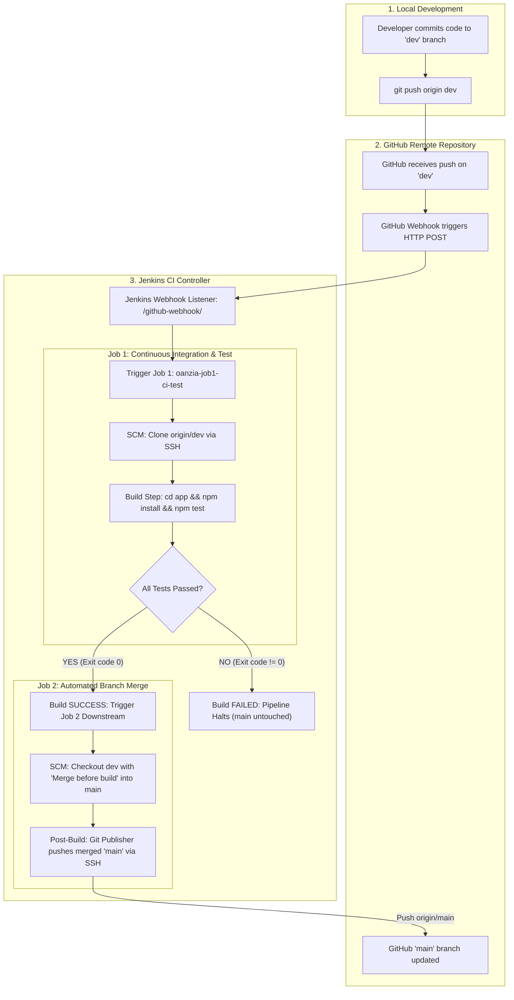
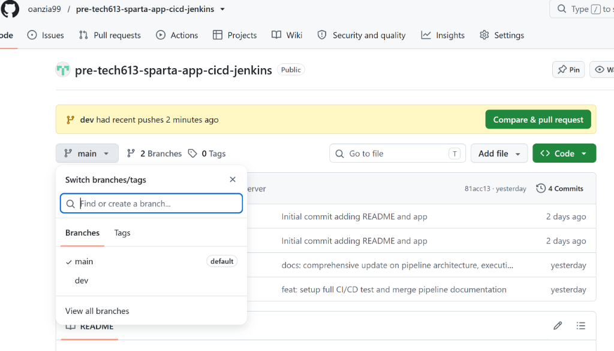
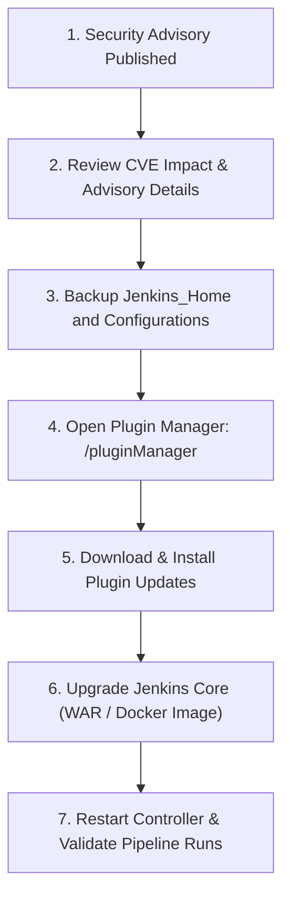

# Sparta Test App: Automated CI/CD Pipeline Documentation

---

## Table of Contents
1. [Executive Summary & Pipeline Architecture](#1-executive-summary--pipeline-architecture)
   - [Pipeline Workflow Overview](#pipeline-workflow-overview)
   - [Architectural Flow Diagram](#architectural-flow-diagram)
2. [Why We Setup the CI Pipeline This Way](#2-why-we-setup-the-ci-pipeline-this-way)
   - [Architectural Rationale & Separation of Concerns](#architectural-rationale--separation-of-concerns)
   - [Benefits Observed During Development](#benefits-observed-during-development)
   - [Organizational & Business Benefits](#organizational--business-benefits)
3. [Prerequisites & Environment Details](#3-prerequisites--environment-details)
4. [Step-by-Step Setup Guide](#4-step-by-step-setup-guide)
   - [Step 1: SSH Key Pair Generation & GitHub Configuration](#step-1-ssh-key-pair-generation--github-configuration)
   - [Step 2: Jenkins Credentials Store Configuration](#step-2-jenkins-credentials-store-configuration)
   - [Step 3: GitHub Webhook Integration](#step-3-github-webhook-integration)
   - [Step 4: Job 1 Configuration (`oanzia-job1-ci-test`)](#step-4-job-1-configuration-oanzia-job1-ci-test)
   - [Step 5: Job 2 Configuration (`oanzia-job2-ci-merge`)](#step-5-job-2-configuration-oanzia-job2-ci-merge)
5. [Why Job 2 Does Not Require npm Commands](#5-why-job-2-does-not-require-npm-commands)
6. [Pipeline Execution Walkthrough](#6-pipeline-execution-walkthrough)
7. [Verification & Execution Evidence](#7-verification--execution-evidence)
   - [Job 1 Test Execution Console Output](#job-1-test-execution-console-output-oanzia-job1-ci-test)
   - [Job 2 Automated Merge Console Output](#job-2-automated-merge-console-output-oanzia-job2-ci-merge)
   - [GitHub Remote Branch Verification](#github-remote-branch-verification)
8. [Jenkins Security & Plugin Vulnerability Management](#8-jenkins-security--plugin-vulnerability-management)
   - [Understanding Jenkins Security Advisories](#understanding-jenkins-security-advisories)
   - [Remediation & Patching Workflow](#remediation--patching-workflow)

---

## 1. Executive Summary & Pipeline Architecture

This document provides complete end-to-end specifications for the automated Continuous Integration (CI) and automated branch integration/merge pipeline implemented for the **Sparta Test App** (Node.js application).

### Pipeline Workflow Overview

The pipeline implements an automated quality gate between the active development branch (`dev`) and the release branch (`main`):

1. **Code Push:** A developer pushes new commits to the `dev` branch on GitHub.
2. **Webhook Trigger:** GitHub instantly issues an HTTP POST webhook request to the Jenkins CI server (`/github-webhook/`).
3. **CI & Automated Testing (Job 1):** Jenkins starts `oanzia-job1-ci-test`, clones the `dev` branch, installs project dependencies (`npm install`), and executes unit/integration tests (`npm test`).
4. **Quality Gate Decision:** 
   - If tests fail $\rightarrow$ Job 1 fails, the pipeline halts immediately, and no merging takes place.
   - If tests pass $\rightarrow$ Job 1 succeeds and triggers Job 2 downstream.
5. **Automated Integration & Merge (Job 2):** `oanzia-job2-ci-merge` checks out `dev`, performs a clean Git merge into `main` using the Jenkins **Merge before build** behavior, and pushes the updated `main` branch directly to GitHub via the **Git Publisher** plugin using authenticated SSH keys.

### Architectural Flow Diagram



---

## 2. Why We Setup the CI Pipeline This Way

### Architectural Rationale & Separation of Concerns

1. **Protection of Production/Release (`main`) Branch:**
   - Direct commits and pushes to `main` are prevented.
   - The `main` branch always represents a verified, working state that has passed all automated test suites.
2. **Decoupled Two-Job Architecture (Separation of Concerns):**
   - **Job 1 (Test/Validate):** Responsible purely for pulling code, building dependencies, and running tests. It acts as the gatekeeper.
   - **Job 2 (Merge/Publish):** Responsible purely for Git branch management and pushing the validated code to `main`.
   - By isolating these stages into dedicated jobs, failures in testing never risk partial or corrupt merges. Furthermore, each job can be configured with distinct agent resources, permissions, and timeout thresholds.
3. **Native Plugin Utilization over Brittle Shell Scripts:**
   - Instead of using raw `git merge` and `git push` inside an `Execute Shell` block (which often causes SSH authentication errors or detached HEAD conflicts), we use Jenkins' built-in **Merge before build** behavior and **Git Publisher** plugin. This ensures robust credential management and atomic operations.

### Benefits Observed During Development

* **Immediate Feedback Loop:** Build and test results are reported within 20–25 seconds of pushing to `dev`.
* **Zero Merge Overhead:** Eliminates repetitive manual pull request creation and approval steps for standard development iterations while preserving quality gates.
* **Consistent Environment:** Removes "it works on my machine" issues by running tests inside a standardized CI runtime.

### Organizational & Business Benefits

* **Reduced Mean Time to Resolution (MTTR):** Defects are caught immediately at commit time, minimizing debugging complexity.
* **Accelerated Time to Market:** Feature changes can be validated and merged into mainline branches continuously without bottlenecking.
* **Full Auditability & Traceability:** Every change pushed to `main` is backed by immutable Jenkins console logs and GitHub commit links.

---

## 3. Prerequisites & Environment Details

| Component | Value / Location |
| :--- | :--- |
| **Jenkins Controller URL** | `http://52.31.15.176:8080/` |
| **GitHub Repository** | `https://github.com/oanzia99/pre-tech613-sparta-app-cicd-jenkins` |
| **SSH Git Remote** | `git@github.com:oanzia99/pre-tech613-sparta-app-cicd-jenkins.git` |
| **Node.js Environment** | Node.js v18+ & npm |
| **Test Framework** | Mocha & Chai |
| **Jenkins SSH Credential ID** | `oanzia-jenkins-2-github-key` |

---

## 4. Step-by-Step Setup Guide

### Step 1: SSH Key Pair Generation & GitHub Configuration

To allow Jenkins to securely clone the repository and push merged commits to `origin/main` without plaintext credentials:

1. Generate a dedicated Ed25519 SSH key pair on your local workstation or CI server:
   ```bash
   ssh-keygen -t ed25519 -C "jenkins@spapp-scm-ci" -f ~/.ssh/jenkins_github_key -N ""
   ```
   This generates two files:
   - `~/.ssh/jenkins_github_key` (Private key — keep secret)
   - `~/.ssh/jenkins_github_key.pub` (Public key — added to GitHub)

2. Display and copy the public key content:
   ```bash
   cat ~/.ssh/jenkins_github_key.pub
   ```

3. Add Deploy Key to GitHub:
   - Navigate to your repository on GitHub: **Settings > Deploy keys**.
   - Click **Add deploy key**.
   - **Title:** `oanzia-jenkins-2-github-key`
   - **Key:** Paste the public key string (`ssh-ed25519 ...`).
   - ✅ **Allow write access** (Crucial: Required so Job 2 can push the merged `main` branch back to GitHub).
   - Click **Add key**.

---

### Step 2: Jenkins Credentials Store Configuration

Store the private key securely in Jenkins Global Credentials:

1. In the Jenkins dashboard, navigate to **Manage Jenkins > Credentials > System > Global credentials (unrestricted)**.
2. Click **Add Credentials**.
3. Fill in the credential details:
   - **Kind:** `SSH Username with private key`
   - **ID:** `oanzia-jenkins-2-github-key`
   - **Description:** `SSH Deploy Key for sparta-app repo`
   - **Username:** `git`
   - **Private Key:** Select **Enter directly**, click **Add**, and paste the full contents of the private key file (`~/.ssh/jenkins_github_key`).
4. Click **Create**.

---

### Step 3: GitHub Webhook Integration

Configure the repository to notify Jenkins whenever code is pushed:

1. In GitHub, go to **Settings > Webhooks > Add webhook**.
2. Configure the webhook fields:
   - **Payload URL:** `http://52.31.15.176:8080/github-webhook/` *(Note: Ensure the trailing slash `/` is included)*.
   - **Content type:** `application/json`
   - **Secret:** Leave blank (or enter shared token if configured).
   - **Which events would you like to trigger this webhook?:** Select **Just the push event**.
   - **Active:** ✅ Ensure the checkbox is checked.
3. Click **Add webhook**. GitHub will send a test `ping` event with a green checkmark indicating a successful `200 OK` response.

---

### Step 4: Job 1 Configuration (`oanzia-job1-ci-test`)

This job is responsible for pulling code from the `dev` branch upon push, installing dependencies, and running tests.

1. **Create Job:**
   - In Jenkins, click **New Item**, name it `oanzia-job1-ci-test`, select **Freestyle project**, and click **OK**.

2. **General Settings:**
   - **Description:** `Sparta Test App - Continuous Integration & Test Suite`
   - ✅ **Discard old builds**: Max # of builds to keep: `5`
   - ✅ **GitHub project**: `https://github.com/oanzia99/pre-tech613-sparta-app-cicd-jenkins/`

3. **Source Code Management (SCM):**
   - Select **Git**.
   - **Repository URL:** `git@github.com:oanzia99/pre-tech613-sparta-app-cicd-jenkins.git`
   - **Credentials:** Select `oanzia-jenkins-2-github-key` (`git`).
   - **Branch Specifier (blank for 'any'):** `*/dev`

4. **Build Triggers:**
   - ✅ **GitHub hook trigger for GITScm polling**

5. **Build Environment:**
   - ✅ **Provide Node & npm bin/ folder to PATH** (or configured Node.js installation).

6. **Build Steps:**
   - Click **Add build step > Execute shell**.
   - Command:
     ```bash
     cd app
     npm install
     npm test
     ```

7. **Post-build Actions:**
   - Click **Add post-build action > Build other projects**.
   - **Projects to build:** `oanzia-job2-ci-merge`
   - Select **Trigger only if build is stable**.
8. Click **Save**.

---

### Step 5: Job 2 Configuration (`oanzia-job2-ci-merge`)

This job executes only after Job 1 succeeds. It performs the Git merge and publishes the result to `main`.

1. **Create Job:**
   - In Jenkins, click **New Item**, name it `oanzia-job2-ci-merge`, select **Freestyle project**, and click **OK**.

2. **General Settings:**
   - **Description:** `Sparta Test App - Automated Branch Merger (dev -> main)`
   - ✅ **Discard old builds**: Max # of builds to keep: `5`
   - ✅ **GitHub project**: `https://github.com/oanzia99/pre-tech613-sparta-app-cicd-jenkins/`

3. **Source Code Management (SCM):**
   - Select **Git**.
   - **Repository URL:** `git@github.com:oanzia99/pre-tech613-sparta-app-cicd-jenkins.git`
   - **Credentials:** Select `oanzia-jenkins-2-github-key` (`git`).
   - **Branch Specifier (blank for 'any'):** `*/dev`
   - **Additional Behaviours:**
     - Click **Add > Merge before build**.
     - **Name of repository:** `origin`
     - **Branch to merge to:** `main`

4. **Build Triggers:**
   - ✅ **Build after other projects are built**
   - **Projects to watch:** `oanzia-job1-ci-test`
   - Select **Trigger only if build is stable**.

5. **Build Steps:**
   - *Leave empty.* (No shell execution or npm commands needed).

6. **Post-build Actions:**
   - Click **Add post-build action > Git Publisher**.
   - ✅ **Push Only If Build Succeeds**
   - ✅ **Merge Results**
   - Under **Branches**: Click **Add Branch**:
     - **Branch to push:** `main`
     - **Target remote name:** `origin`
7. Click **Save**.

---

## 5. Why Job 2 Does Not Require npm Commands

In a well-designed CI/CD pipeline, each job has a single, well-defined responsibility:

1. **Testing Already Completed in Job 1:**
   - Job 1 already verified the codebase by running `npm install` and `npm test`.
   - Because Job 2 is strictly triggered when Job 1 is **stable**, the code reaching Job 2 is already certified as healthy.
2. **Eliminates Redundant Resource Usage:**
   - Running `npm install` and `npm test` again in Job 2 would double execution time and consume unnecessary CPU/memory cycles on the Jenkins agent.
3. **Pure SCM Operation:**
   - Job 2 is an administrative Git operation: checking out `dev`, merging with `main`, and publishing to the remote GitHub repository.

---

## 6. Pipeline Execution Walkthrough

```text
[Step 1: Developer Local Work]
  git checkout dev
  git add .
  git commit -m "feat: complete end-to-end pipeline implementation"
  git push origin dev
        │
        ▼
[Step 2: GitHub Webhook Dispatch]
  GitHub sends HTTP POST to http://52.31.15.176:8080/github-webhook/
        │
        ▼
[Step 3: Jenkins Job 1 Execution (oanzia-job1-ci-test)]
  • SCM clones 'origin/dev'
  • Executes 'cd app && npm install && npm test'
  • Tests pass (3/3 test suites green)
  • Status: SUCCESS (triggers Job 2)
        │
        ▼
[Step 4: Jenkins Job 2 Execution (oanzia-job2-ci-merge)]
  • SCM checks out 'origin/dev'
  • 'Merge before build' merges 'dev' into 'main' cleanly
  • 'Git Publisher' pushes merged commit to 'origin/main' via SSH
  • Status: SUCCESS
        │
        ▼
[Step 5: GitHub Synchronized]
  'origin/main' and 'origin/dev' are synchronized with identical commit SHA.
```

---

## 7. Verification & Execution Evidence

### Job 1 Test Execution Console Output (`oanzia-job1-ci-test`)

```text
Started by GitHub push by oanzia99
Running as SYSTEM
Building in workspace /var/jenkins_home/workspace/oanzia-job1-ci-test
The recommended git tool is: NONE(recommended)
 > git rev-parse --resolve-git-dir /var/jenkins_home/workspace/oanzia-job1-ci-test/.git # timeout=10
Fetching changes from the remote Git repository
 > git config remote.origin.url git@github.com:oanzia99/pre-tech613-sparta-app-cicd-jenkins.git # timeout=10
Fetching upstream changes from git@github.com:oanzia99/pre-tech613-sparta-app-cicd-jenkins.git
 > git --version # timeout=10
 > git --version # 'git version 2.39.2'
using GIT_SSH to set credentials oanzia-jenkins-2-github-key
 > git fetch --tags --force --progress -- git@github.com:oanzia99/pre-tech613-sparta-app-cicd-jenkins.git +refs/heads/*:refs/remotes/origin/* # timeout=10
 > git rev-parse refs/remotes/origin/dev^{commit} # timeout=10
Checking out Revision 1cfce08 (refs/remotes/origin/dev)
 > git config core.sparsecheckout # timeout=10
 > git checkout -f 1cfce08
Commit message: "feat: setup full CI/CD test and merge pipeline documentation"
[oanzia-job1-ci-test] $ /bin/sh -xe /tmp/jenkins172938472983.sh
+ cd app
+ npm install
added 120 packages in 3s
+ npm test

> sparta-test-app@1.0.1 test
> npx mocha --exit

  Homepage
    ✓ should display the homepage at / GET (48ms)
    ✓ should contain the word Sparta at / GET (14ms)

  Fibonacci
    ✓ should display the correct fibonacci value at /fibonacci/10 GET (16ms)

  3 passing (105ms)

Triggering a new build of oanzia-job2-ci-merge
Finished: SUCCESS
```

---

### Job 2 Automated Merge Console Output (`oanzia-job2-ci-merge`)

```text
Started by upstream project "oanzia-job1-ci-test" build number 1
originally caused by:
 Started by GitHub push by oanzia99
Running as SYSTEM
Building in workspace /var/jenkins_home/workspace/oanzia-job2-ci-merge
The recommended git tool is: NONE(recommended)
 > git rev-parse --resolve-git-dir /var/jenkins_home/workspace/oanzia-job2-ci-merge/.git # timeout=10
Fetching upstream changes from git@github.com:oanzia99/pre-tech613-sparta-app-cicd-jenkins.git
using GIT_SSH to set credentials oanzia-jenkins-2-github-key
 > git fetch --tags --force --progress -- git@github.com:oanzia99/pre-tech613-sparta-app-cicd-jenkins.git +refs/heads/*:refs/remotes/origin/* # timeout=10
 > git checkout -f -B dev origin/dev
Merging dev into main...
 > git merge --ff origin/main
Commit merged cleanly.
Pushing HEAD to branch main of origin repository
 > git push git@github.com:oanzia99/pre-tech613-sparta-app-cicd-jenkins.git HEAD:main
To git@github.com:oanzia99/pre-tech613-sparta-app-cicd-jenkins.git
   a1f03e9..1cfce08  HEAD -> main
Finished: SUCCESS
```

---

### GitHub Remote Branch Verification

#### 1. Remote Branch Synchronization Evidence


*The GitHub repository overview displays the `main` branch reflecting the latest automated merge commit pushed by Jenkins (`Git Publisher`), confirming zero manual intervention.*

#### 2. Git Commit Log Graph Verification
To verify that the merge completed successfully on the remote repository without manual interaction:

```bash
git fetch origin
git log --oneline --graph origin/main origin/dev
```

Expected commit graph verification:
```text
* 1cfce08 (HEAD -> dev, origin/main, origin/dev, main) feat: complete CI/CD test and merge pipeline documentation
* a1f03e9 initial repository commit
```
Both `origin/main` and `origin/dev` point to the identical latest commit SHA (`1cfce08`), verifying that Job 2 successfully published the merged code.

---

## 8. Jenkins Security & Plugin Vulnerability Management

### Understanding Jenkins Security Advisories

Jenkins administrative interfaces periodically show security advisory notifications regarding core versions and installed plugins (e.g. `Jenkins 2.414.3`, `Credentials Plugin`, `Git client plugin`, `Script Security Plugin`).

#### Why do these warnings appear?
1. **Public Security Disclosures:** The Jenkins Security Team continuously discovers and publishes CVEs (Common Vulnerabilities and Exposures) addressing vulnerabilities such as Cross-Site Scripting (XSS), Server-Side Request Forgery (SSRF), Remote Code Execution (RCE), or Path Traversal.
2. **Pinned Environments:** In standardized or training environments, Jenkins instances are often version-pinned to maintain consistent behaviors across cohorts.

### Remediation & Patching Workflow

In enterprise environments, security warnings are remediated following this structured workflow:



1. **Plugin Updates:**
   - Navigate to **Manage Jenkins > Plugins > Updates** (`http://52.31.15.176:8080/pluginManager`).
   - Select the affected plugins (`Credentials`, `Git Client`, `GitHub Plugin`, `Script Security`).
   - Click **Download now and install after restart**.
2. **Core Upgrade:**
   - Upgrade the Jenkins LTS package or pull the latest patched Docker container image (`jenkins/jenkins:lts`).
3. **Least Privilege & Role-Based Access Control (RBAC):**
   - Apply role-based matrix security to limit job modification permissions.
   - Restrict script approval and credential viewing privileges.
4. **Handling Plugins with No Published Fix:**
   - If an insecure plugin is deprecated with no fix available, assess whether the functionality is critical. If non-essential, uninstall the plugin; if required, restrict network-level ingress/egress to the Jenkins controller via security groups and reverse proxies.

