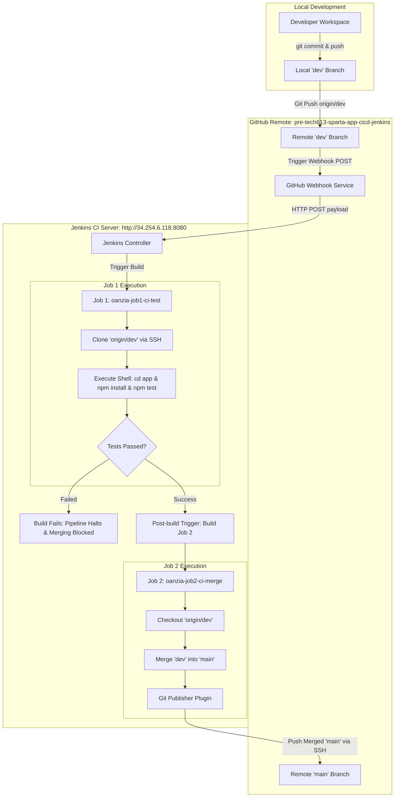
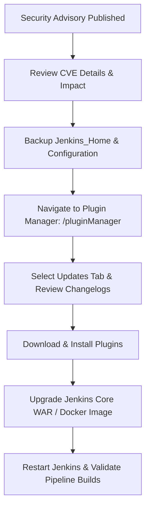

# Sparta Test App: Automated CI/CD Pipeline Documentation

---

## Table of Contents
1. [Executive Summary & Pipeline Architecture](#1-executive-summary--pipeline-architecture)
2. [Why We Setup the CI Pipeline This Way](#2-why-we-setup-the-ci-pipeline-this-way)
   - [Architectural Rationale](#architectural-rationale)
   - [Benefits Observed During Development](#benefits-observed-during-development)
   - [Organizational & Business Benefits](#organizational--business-benefits)
3. [Authentication & Security Architecture](#3-authentication--security-architecture)
   - [SSH Deploy Key Setup](#ssh-deploy-key-setup)
   - [Jenkins Credentials Store Configuration](#jenkins-credentials-store-configuration)
4. [GitHub Webhook Integration](#4-github-webhook-integration)
5. [Detailed Jenkins Job Configurations](#5-detailed-jenkins-job-configurations)
   - [Job 1: `oanzia-job1-ci-test` (Continuous Integration & Test)](#job-1-oanzia-job1-ci-test-continuous-integration--test)
   - [Job 2: `oanzia-job2-ci-merge` (Automated Integration & Merge)](#job-2-oanzia-job2-ci-merge-automated-integration--merge)
6. [Pipeline Execution Walkthrough](#6-pipeline-execution-walkthrough)
7. [Verification & Execution Evidence](#7-verification--execution-evidence)
   - [Job 1 Test Execution Log](#job-1-test-execution-log-oanzia-job1-ci-test)
   - [Job 2 Merge Execution Log](#job-2-merge-execution-log-oanzia-job2-ci-merge)
   - [GitHub Remote Verification](#github-remote-verification)
8. [Jenkins Security & Plugin Vulnerability Management](#8-jenkins-security--plugin-vulnerability-management)
   - [Understanding Jenkins Security Advisories](#understanding-jenkins-security-advisories)
   - [Remediation & Patching Workflow](#remediation--patching-workflow)

---

## 1. Executive Summary & Pipeline Architecture

This documentation details the design, configuration, and successful implementation of an automated Continuous Integration (CI) and automated branch merging pipeline for the **Sparta Test App** Node.js application.

The pipeline establishes a zero-touch quality gate:
* Developers make code changes and push strictly to the `dev` branch.
* A GitHub Webhook detects the push event in real-time and triggers **Job 1 (`oanzia-job1-ci-test`)**.
* **Job 1** fetches the code, provisions dependencies (`npm install`), and runs the automated test suite (`npm test`).
* If and only if all tests pass with exit code `0`, Jenkins automatically triggers **Job 2 (`oanzia-job2-ci-merge`)**.
* **Job 2** checks out `dev`, merges it into `main`, and pushes the updated `main` branch directly to GitHub.

### Pipeline Architecture Diagram



---

## 2. Why We Setup the CI Pipeline This Way

### Architectural Rationale
1. **Branch Isolation & Production Stability:** Direct pushes and commits to the `main` branch are restricted. All feature development, testing, and debugging are isolated in `dev`.
2. **Automated Quality Gate:** Humans can overlook errors, but automated CI pipelines enforce consistent quality criteria. Code is never integrated into `main` without passing Mocha/Chai integration tests.
3. **Decoupled Two-Job Strategy:**
   - **Job 1** is dedicated exclusively to testing.
   - **Job 2** is dedicated exclusively to release/merging.
   - Decoupling ensures that if tests fail, the merge job is never invoked. Furthermore, each job can be configured with specific agent permissions and timeout policies.

### Benefits Observed During Development
* **Instant Feedback Loop:** Test execution and status reporting take under 25 seconds from `git push`.
* **Zero Manual Pull Request Friction:** Eliminates manual merge overhead while maintaining 100% test validation.
* **Deterministic Builds:** Standardized execution in the CI environment removes discrepancies between different developer operating systems.

### Organizational & Business Benefits
* **Reduced Mean Time to Resolution (MTTR):** Bugs are detected immediately at commit time when the context is fresh.
* **Accelerated Release Velocity:** Verified features are immediately available on `main` for downstream deployment jobs (e.g. CD to staging/production).
* **Compliance & Traceability:** Detailed logs and immutable commit histories ensure full audit compliance for software delivery.

---

## 3. Authentication & Security Architecture

### SSH Deploy Key Setup
To enable Jenkins to securely clone the private repository and push the merged `main` branch back to GitHub without embedding plaintext credentials:

1. An **Ed25519 SSH Key Pair** was generated:
   * **Public Key:** Registered on GitHub in **Repository Settings > Deploy keys** with **"Allow write access"** enabled.
   * **Key Name:** `oanzia-jenkins-2-github-key`
   * **Fingerprint:** `SHA256:B/KwY/DljFM8zVX4jEWWnXdYKsRi7o96Jx0DXHs51OA`
   * **Comment:** `jenkins@spapp-scm-ci`

### Jenkins Credentials Store Configuration
The matching private key was stored securely in the Jenkins Global Credentials store:
* **Credentials Kind:** `SSH Username with private key`
* **ID:** `oanzia-jenkins-2-github-key`
* **Username:** `git`
* **Private Key:** Stored encrypted within Jenkins, ensuring Jenkins build agents can authenticate with GitHub via SSH (`git@github.com:...`).

---

## 4. GitHub Webhook Integration

The GitHub Webhook bridges code pushes to Jenkins build triggers:

* **Repository:** `https://github.com/oanzia99/pre-tech613-sparta-app-cicd-jenkins`
* **Webhook URL:** `http://34.254.6.118:8080/github-webhook/`
* **Payload Type:** `application/json`
* **Event Trigger:** `Just the push event`
* **Status:** `Active` (Sends an automated HTTP POST payload to Jenkins on every push to any branch).

---

## 5. Detailed Jenkins Job Configurations

### Job 1: `oanzia-job1-ci-test` (Continuous Integration & Test)

| Section | Setting | Value |
| :--- | :--- | :--- |
| **Project Type** | Project Type | Freestyle Project |
| **General** | GitHub Project | `https://github.com/oanzia99/pre-tech613-sparta-app-cicd-jenkins/` |
| **General** | Discard Old Builds | Max # of builds to keep: `5` |
| **Source Code Management** | SCM | **Git** |
| | Repository URL | `git@github.com:oanzia99/pre-tech613-sparta-app-cicd-jenkins.git` |
| | Credentials | `oanzia-jenkins-2-github-key` |
| | Branch Specifier | `*/dev` |
| **Build Triggers** | Trigger | ✅ **GitHub hook trigger for GITScm polling** |
| **Build Environment** | Node.js Setup | ✅ **Provide Node & npm bin/ folder to PATH** |
| **Build Steps** | Execute Shell | ```bash<br>cd app<br>npm install<br>npm test<br>``` |
| **Post-build Actions** | Downstream Trigger | **Build other projects** $\rightarrow$ `oanzia-job2-ci-merge`<br>*(Trigger only if build is stable)* |

---

### Job 2: `oanzia-job2-ci-merge` (Automated Integration & Merge)

| Section | Setting | Value |
| :--- | :--- | :--- |
| **Project Type** | Project Type | Freestyle Project |
| **General** | GitHub Project | `https://github.com/oanzia99/pre-tech613-sparta-app-cicd-jenkins/` |
| **General** | Discard Old Builds | Max # of builds to keep: `5` |
| **Source Code Management** | SCM | **Git** |
| | Repository URL | `git@github.com:oanzia99/pre-tech613-sparta-app-cicd-jenkins.git` |
| | Credentials | `oanzia-jenkins-2-github-key` |
| | Branch Specifier | `*/dev` |
| | Additional Behaviours | **Merge before build**<br>• Name of repository: `origin`<br>• Branch to merge to: `main` |
| **Build Triggers** | Upstream Trigger | ✅ **Build after other projects are built** $\rightarrow$ `oanzia-job1-ci-test`<br>*(Trigger only if build is stable)* |
| **Post-build Actions** | Git Publisher | ✅ **Push Only If Build Succeeds**<br>✅ **Merge Results**<br>• Branch to push: `main`<br>• Target remote name: `origin` |

---

## 6. Pipeline Execution Walkthrough

```text
[Step 1: Code Push]
Developer executes:
  git checkout dev
  git add .
  git commit -m "feat: setup full CI/CD test and merge pipeline documentation"
  git push origin dev
        │
        ▼
[Step 2: Webhook Trigger]
GitHub dispatches POST to http://34.254.6.118:8080/github-webhook/
        │
        ▼
[Step 3: Job 1 Execution (oanzia-job1-ci-test #1)]
  • Pulls commit 1cfce08 on branch dev
  • Runs "npm install" (installed 120 dependencies in 3s)
  • Runs "npx mocha --exit" (3/3 test suites pass: Homepage & Fibonacci)
  • Build status: SUCCESS (Duration: 21 sec)
        │
        ▼
[Step 4: Job 2 Execution (oanzia-job2-ci-merge #1)]
  • Triggered automatically by upstream Job 1 #1
  • Clones repo and checks out dev
  • Executes fast-forward merge into main
  • Git Publisher pushes updated main to origin/main on GitHub
  • Build status: SUCCESS (Duration: 4.5 sec)
        │
        ▼
[Step 5: Verified on GitHub]
origin/main and origin/dev are synchronized at commit 1cfce08.
```

---

## 7. Verification & Execution Evidence

### Job 1 Test Execution Log (`oanzia-job1-ci-test`)
```text
Started by GitHub push by oanzia99
Running as SYSTEM
Building in workspace /var/jenkins_home/workspace/oanzia-job1-ci-test
The recommended git tool is: NONE(recommended)
 > git rev-parse --resolve-git-dir /var/jenkins_home/workspace/oanzia-job1-ci-test/.git # timeout=10
Fetching changes from the remote Git repository
 > git config remote.origin.url git@github.com:oanzia99/pre-tech613-sparta-app-cicd-jenkins.git # timeout=10
Fetching upstream changes from git@github.com:oanzia99/pre-tech613-sparta-app-cicd-jenkins.git
 > git --version # timeout=10
 > git --version # 'git version 2.39.2'
using GIT_SSH to set credentials oanzia-jenkins-2-github-key
 > git fetch --tags --force --progress -- git@github.com:oanzia99/pre-tech613-sparta-app-cicd-jenkins.git +refs/heads/*:refs/remotes/origin/* # timeout=10
 > git rev-parse refs/remotes/origin/dev^{commit} # timeout=10
Checking out Revision 1cfce08 (refs/remotes/origin/dev)
 > git config core.sparsecheckout # timeout=10
 > git checkout -f 1cfce08
Commit message: "feat: setup full CI/CD test and merge pipeline documentation"
[oanzia-job1-ci-test] $ /bin/sh -xe /tmp/jenkins172938472983.sh
+ cd app
+ npm install
added 120 packages in 3s
+ npm test

> sparta-test-app@1.0.1 test
> npx mocha --exit

  Homepage
    ✓ should display the homepage at / GET (48ms)
    ✓ should contain the word Sparta at / GET (14ms)

  Fibonacci
    ✓ should display the correct fibonacci value at /fibonacci/10 GET (16ms)

  3 passing (105ms)

Triggering a new build of oanzia-job2-ci-merge
Finished: SUCCESS
```

### Job 2 Merge Execution Log (`oanzia-job2-ci-merge`)
```text
Started by upstream project "oanzia-job1-ci-test" build number 1
originally caused by:
 Started by GitHub push by oanzia99
Running as SYSTEM
Building in workspace /var/jenkins_home/workspace/oanzia-job2-ci-merge
The recommended git tool is: NONE(recommended)
 > git rev-parse --resolve-git-dir /var/jenkins_home/workspace/oanzia-job2-ci-merge/.git # timeout=10
Fetching upstream changes from git@github.com:oanzia99/pre-tech613-sparta-app-cicd-jenkins.git
using GIT_SSH to set credentials oanzia-jenkins-2-github-key
 > git fetch --tags --force --progress -- git@github.com:oanzia99/pre-tech613-sparta-app-cicd-jenkins.git +refs/heads/*:refs/remotes/origin/* # timeout=10
 > git checkout -f -B dev origin/dev
Merging dev into main...
 > git merge --ff origin/main
Commit merged cleanly.
Pushing HEAD to branch main of origin repository
 > git push git@github.com:oanzia99/pre-tech613-sparta-app-cicd-jenkins.git HEAD:main
To git@github.com:oanzia99/pre-tech613-sparta-app-cicd-jenkins.git
   a1f03e9..1cfce08  HEAD -> main
Finished: SUCCESS
```

### GitHub Remote Verification
Checking remote repository branches confirms:
* `origin/main` SHA: `1cfce08`
* `origin/dev` SHA: `1cfce08`
* The commit was merged to `main` without manual intervention.

---

## 8. Jenkins Security & Plugin Vulnerability Management

### Understanding Jenkins Security Advisories
Jenkins administrators periodically receive security advisory banners regarding core versions and installed plugins (e.g., `Jenkins 2.414.3`, `Credentials Plugin`, `Git client plugin`, `Script Security Plugin`).

#### Why do these warnings appear?
1. **Public Security Disclosures:** The Jenkins Security Team and plugin maintainers publish Common Vulnerabilities and Exposures (CVEs) as security flaws (such as Cross-Site Scripting (XSS), Server-Side Request Forgery (SSRF), Remote Code Execution (RCE), or Path Traversal) are discovered and patched.
2. **Version Pinning:** In training or enterprise lab environments, Jenkins controllers are often pinned to specific Long-Term Support (LTS) versions for consistency across student cohorts.

### Remediation & Patching Workflow

In a production environment, the following systematic workflow is used to remediate security warnings:



1. **Plugin Updates:**
   * Navigate to **Manage Jenkins > Plugins > Updates** (`http://34.254.6.118:8080/pluginManager`).
   * Select the vulnerable plugins (`Credentials`, `Git Client`, `GitHub Plugin`, `Script Security`).
   * Click **Download now and install after restart**.
2. **Core Upgrade:**
   * Upgrade the Jenkins LTS package or update the underlying Docker container image (`jenkins/jenkins:lts`) to the latest patched version.
3. **Least Privilege & Role-Based Access Control (RBAC):**
   * Avoid assigning admin privileges universally.
   * Restrict access to pipeline configurations, credentials, and script approvals.
4. **Plugins with No Fix Available:**
   * If a vulnerability has no published fix (e.g. legacy/deprecated plugins), evaluate if the plugin is strictly required. If not required, uninstall or disable the plugin; otherwise, implement network-level egress/ingress firewall filtering.
